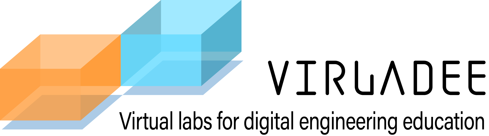

# VirLaDEE Book

## Introduction

Virladee is a project [funded by the European Commission’s Erasmus + programme](https://erasmus-plus.ec.europa.eu/projects/search/details/2020-1-DK01-KA226-HE-094270). Starting in March 2021, the project involves three partners:

* University of Southern Denmark (SDU)
* Tallinn University of Technology (TalTech)
* Consiglio Nazionale Delle Ricerche – STIIMA (CNR-STIIMA)

The European Commission's support for the production of this publication does not constitute an endorsement of the contents, which reflect the views only of the authors, and the Commission cannot be held responsible for any use which may be made of the information contained therein.
Background

The European Commission promotes a variety of initiatives within the scope of digital strategy. It aims at several focused areas such as increasing training in digital skills, modernising education across the EU and harnessing digital technologies for learning. From the educational perspective, teaching engineering-related topics such as robotics and automation often require access to a lab environment where many resources can be used, demonstrated and tested.

However, the COVID-19 pandemic has forced more than 1.5 billion students to stay at home and access teaching and education through the internet and other digital resources. Although the transition to online platforms can be done without many issues for teaching theoretical classes, the current e-learning tools such as Zoom and Teams are not sufficient to replace practical classes and direct experience in real labs. Some online platforms provide engineering tools, for example, Autodesk TinkerCAD for 3D and circuit design, but they do not represent an immersive physical engineering lab, the contents on many subjects (e.g., robot control and automation) are missing, and the learning outcomes can't be reached effectively as with lab experiences.
Objectives

This book presents the main results of the project that aimed at giving access to physical engineering labs through their digital twins. These virtual lab facilities provide a playground that is complementary to the existing learning methods delivering quality and inclusive engineering education through state-of-the-art virtual technologies.

## Table of Contents
1. [Requirements for the Design of Virtual Labs](Requirements.md)
2. [Uses of Virtual Labs in Engineering Curricula](Curricula.md)
3. [Best Practices](BestPractices.md)
4. [Guidelines for Technical Developments](Guidelines.md)

