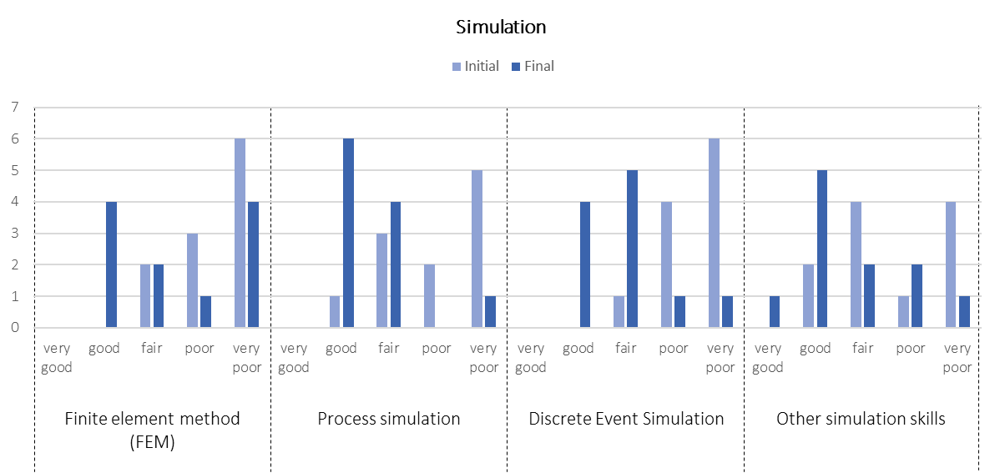
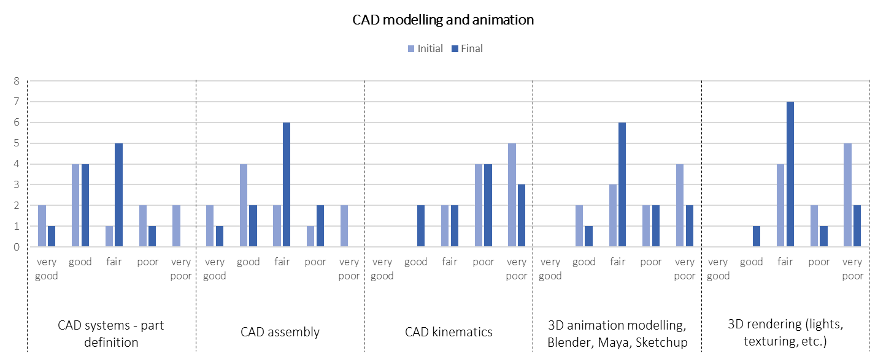
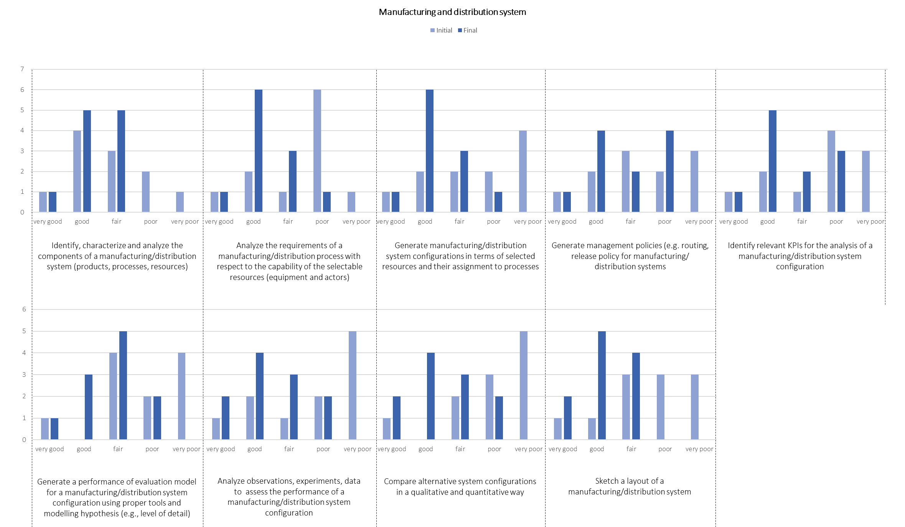
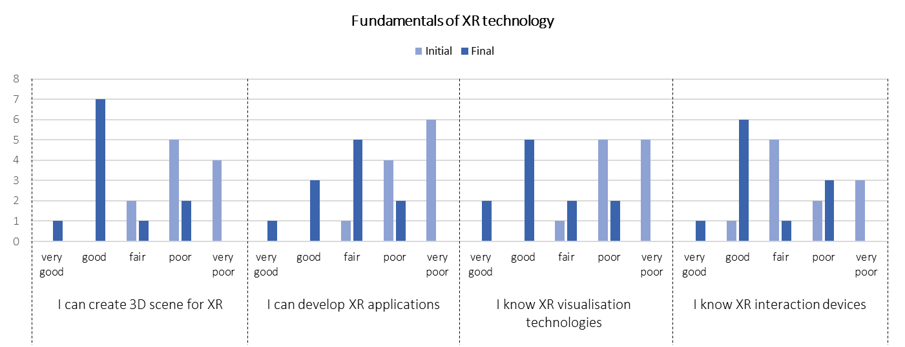
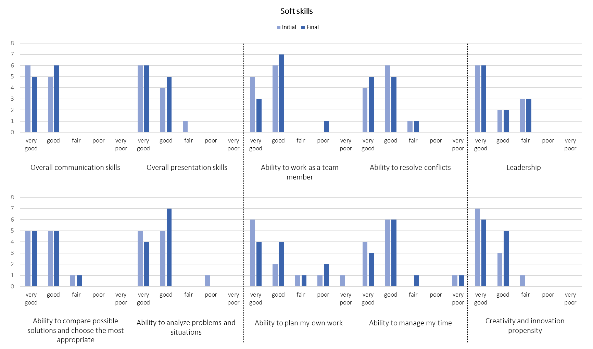
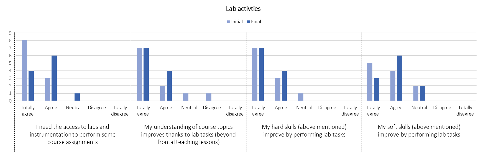
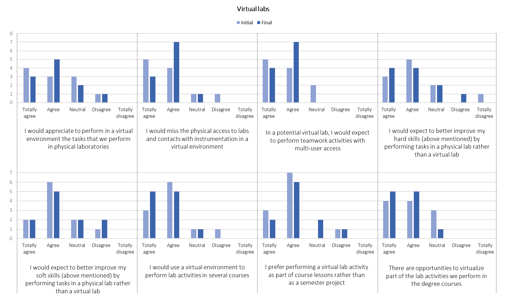

{:.no_toc}
# Uses of Virtual Labs in Engineering Curricula

{:.no_toc}

  

    Table of contents
  

  {: .text-delta }
- TOC
{:toc}

## Design of workshops

A Virtual Lab Workshop is a 5-day event attended by mixed groups of participants including lab managers, teachers, university students, and experts. 

During the VirLaDEE project, 3 Workshops were organized:
1. at Tallinn in May 2022. The first workshop was aimed at providing input for the design of the pilot courses and the development of the prototype virtual labs, thus fostering digital skills, knowledge of programming languages and development of XR solutions underpinning the DTs of physical labs. It involved lab managers and teachers from TalTech, experts from CNR-STIIMA and SDU, and university students from both TalTech and SDU. 
2. at Sonderborg in November/December 2022. The second workshop was aimed at boosting XR competences within the production context, with study of different enabling technologies for smart manufacturing and how these can be integrated in the virtual lab concept to enhance a more immersive learning experience. It involved lab managers and teachers from SDU, experts from CNR-STIIMA and TalTech, and university students from both TalTech and SDU.
3. at Tallinn in May 2023. The third workshop was aimed at finalizing the design of the VirLaDEE workshop while exploiting the lectures already designed for the first and second workshop. In addition, the studentes had the opportunity to join the VirLaDEE multiplier event. The workshop involved lab managers and teachers from TalTech, experts from CNR-STIIMA and SDU, and university students from both TalTech and SDU . 

The workshops were aimed at:
* establishing and improving the virtual lab concept for teaching
* testing and verification of the prototype virtual labs
* collecting users' feedback before and after the workshop via a questionnaire and interviews

As an example, the detailed program of the 2nd Workshop is presented.  

<table>
<colgroup>
<col style="width: 10%" />
<col style="width: 17%" />
<col style="width: 17%" />
<col style="width: 17%" />
<col style="width: 17%" />
<col style="width: 17%" />
</colgroup>
<thead>
<tr class="header">
<th>

<strong>Room: M401</strong>

</th>
<th>

Monday, 28.11

</th>
<th>

Tuesday, 29.11

</th>
<th>

Wednesday, 30.11

</th>
<th>

Thursday, 01.12

</th>
<th>

Friday, 02.12

</th>
</tr>
</thead>
<tbody>
<tr class="odd">
<td>

08:30 - 12:00

</td>
<td>

Welcome

Tour of SDU &amp; project-related labs

Get-to-know

Workshop kick-off

</td>
<td>3D simulation in Visual Components: design, simulate, and validate a
factory or production line</td>
<td>Experimenting &amp; customizing environments within Unity
</td>
<td>Tecnomatix plant simulation + real-time bridge into VR using MoreViz
</td>
<td>
Exercise related to digital twins of manufacturing labs/systems

Building the service model of Virtual Labs: KPI and more for
management &amp; organization
</td>
</tr>
<tr class="even">
<td>

12:00 – 13:00

</td>
<td><em>Lunch break</em></td>
<td><em>Lunch break</em></td>
<td><em>Lunch break</em></td>
<td><em>Lunch break</em></td>
<td><em>Lunch break</em></td>
</tr>
<tr class="odd">
<td>

13:00 – 17:30

</td>
<td>anyLogistix: building a simulation model of a small distribution
system</td>
<td>Intro to the Unity Engine: a roll-a-ball demo project</td>
<td>
Vizard &amp; Python for applications in actual environments

Unity: movements, picking &amp; placing, and more in VR
</td>
<td>Digital twin of manufacturing labs/systems</td>
<td>
Building the service model of Virtual Labs: KPI and more for
management &amp; organization

Workshop wrap-up

</td>
</tr>
</tbody>
</table>

## Design of pilot courses

Exsisting university courses have been selected to run and test the virtual lab concept at SDU and at TalTech, respectively. Smart Product Development is a master course at SDU. Students from both universities explored several emerging technologies and tools in different project activities, which are normally carried out in the innovation lab (SDU) and the IVAR lab (TalTech). 

In addition, the virtual lab-related topics, defined by experts from SDU, TalTech and CNR-STIIMA, have been integrated into the syllabus of a novel prototype university that is detailed here below. 

<table>
<colgroup>
<col style="width: 20%" />
<col style="width: 40%" />
</colgroup>
<thead>
<tr class="header">
<th><strong>Property</strong></th>
<th><strong>Value</strong></th>
</tr>
</thead>
<tbody>
<tr class="odd">
<td>Course name</td>
<td>VirLaDee digitalization course</td>
</tr>
<tr class="even">
<td>Lecture length</td>
<td>4 hours per week</td>
</tr>
<tr class="odd">
<td>Teaching premises and teaching tools</td>
<td><ul>
<li>SDU: Smart Factory Lab, Simulation Lab, VR Lab (SDU Innovation Labs)</li>
<li>TalTech: Democentre, IVAR Lab</li>
<li>E-learning: Moodle is used for everyday work with students.</li>
<li>Extra premises: Computer class is being used for hybrid activities (lectures/exercises/labs)</li>
</ul></td>
</tr>
<tr class="even"><td></td><td></td></tr>
</tbody>
</table>

### Course Description

The course aims at introducing students to the concepts of Industry 4.0 and Digital Manufacturing, to teach necessary tools and give the theoretical background ot this domains.

### Learning outcomes

The student who has successfully passed a course: knows the concepts
of Industry 4.0 and the means of digital manufacturing; is able to
design and create digital and simulation environments of small
production areas and integrate virtual reality possibilities for
simulation purpose; is able to select production indicators and
quality enhancement measures for production monitoring; is able to
design and build functional base for flexible manufacturing systems;
is able to use and integrate machine vision tools in practice and
choose a right tool for AI implementation.

### Evaluation criteria

Group work in groups of 3-5 person on Digitalisation and analysis of
manufacturing unit. Group work gives 40% and test give 60%.

### Group project

Use-case analyze and mapping and proposal of integration of the learned tools.

### Lectures

In below table is the sequence of the lectures proposed by the
lecturers of the SDU, TalTech and CNR. The course is result of the
combination of the related courses and separate lectures from those
three institutions.

<table>
<colgroup>
<col style="width: 9%" />
<col style="width: 30%" />
<col style="width: 18%" />
<col style="width: 22%" />
<col style="width: 19%" />
</colgroup>
<thead>
<tr class="header">
<th><em><strong>#</strong></em></th>
<th>

<em><strong>Content of each item</strong></em>

</th>
<th>

<em><strong>Knowledge</strong></em>

</th>
<th>

<em><strong>Skills</strong></em>

</th>
<th>

<em><strong>Competences</strong></em>

</th>
</tr>
</thead>
<tbody>
<tr class="odd">
<td>1</td>
<td>

Intro to the course; Industry

4.0 trends and future technologies. Technology readiness levels.
Group work.

</td>
<td>

Insight into the Industry 4.0 technological pillars

</td>
<td>

Ability to define the technology readiness level.

</td>
<td>

Ability to define tech. readiness levels and to give insight about
trends in I4.0

</td>
</tr>
<tr class="even">
<td>2</td>
<td>

FMS functionality analysis, mapping, and implementation

</td>
<td>

Knowledge about FMS systems and possibilities of their
integration.

</td>
<td>

Manufacturing system analysis and ability to propose type of FMS into
the process.

</td>
<td>

Ability to define the functionality of designed FMS.

</td>
</tr>
<tr class="odd">
<td>3</td>
<td>

Production digitalisation of different applications and tools
analysis and choice.

Simulations theory and ways of production digitalisation.

</td>
<td>

Knowledge about digital manufacturing concepts, history, and
variations of digitalisation levels.

</td>
<td>

Ability to define various types of manufacturing systems and levels
of digitalisation.

</td>
<td>

Proficiencies in identifying application scenarios for simulation
tasks and basic-level skills in using related software.

</td>
</tr>
<tr class="even">
<td>4</td>
<td>

Digital Twin for Manufacturing Systems: Tools and Applications

</td>
<td>

Knowledge about digital models of manufacturing systems;
synchronisation of real systems and digital models

</td>
<td>

Ability to create and exploit digital models of manufacturing
systems

</td>
<td>

Data modelling, ontology, web- based VR, MQTT, industrial cases

</td>
</tr>
<tr class="odd">
<td>5</td>
<td>

Production digitalization using VR and AR; Unity3d and Vuforia SDK
training

</td>
<td>

Knowledge about VR and areas of its usage.

</td>
<td>

To create a basic VR application in the game engine.

</td>
<td>

Unity Game engine and related packages. Basic of C# programming logic
in Unity

</td>
</tr>
<tr class="even">
<td>6</td>
<td>

Production digitalization using VR and AR; Unity3d and Vuforia SDK
training

</td>
<td>

Knowledge about AR and areas of its usage.

</td>
<td>

To create a basic AR application in the game engine

</td>
<td>

Game engine practical knowledge.

</td>
</tr>
<tr class="odd">
<td>7</td>
<td>

Introduction to Visual Components - basics of Visual Components

</td>
<td>

Knowledge of software layout and functionalities.

</td>
<td>

To create a simulation in VC software of the manufacturing cell.

</td>
<td>

Simulation software practical knowledge.

</td>
</tr>
<tr class="even">
<td>

8

</td>
<td>

Digital Manufacturing, Plant Simulator

</td>
<td>

Knowledge of software layout and the functionalities.

</td>
<td>

To create plant layout in Plant Simulator.

</td>
<td>

Simulation software practical knowledge.

</td>
</tr>
<tr class="odd">
<td>

9

</td>
<td>

Sustainability - Process Modeling, Tripple Bottom Line, Circular
Economy, and Economical Sustainability

</td>
<td>

Theoretical knowledge about Process Modeling, Tripple Bottom Line,
Circular Economy, and Economical Sustainability

</td>
<td>

Ability to identify sustainability issues and apply various models in
practical contexts.

</td>
<td>

Proficiencies in developing solutions that promote sustainability in
relation to discussed theories and models.

</td>
</tr>
<tr class="even">
<td>

10

</td>
<td>

AI, Machine vision and machine vision. Types and methods.

</td>
<td>

Theoretical knowledge about AI, ML, MV and

neural networks.

</td>
<td>

Ability to define the various types of machine learning.

</td>
<td>

Yolo practical knowledge of basic datasets.

</td>
</tr>
<tr class="odd">
<td>

11

</td>
<td>

Additional placeholder for Blockchain, logistics, SM or robotics
addition lectures.

</td>
<td></td>
<td></td>
<td></td>
</tr>
<tr class="even">
<td>

12

</td>
<td>

Group work

</td>
<td colspan="3" rowspan="5"></td>
</tr>
<tr class="odd">
<td>

13

</td>
<td>

Mentoring session

</td>
</tr>
<tr class="even">
<td>

14

</td>
<td>

Group work

</td>
</tr>
<tr class="odd">
<td>

15

</td>
<td>

Group work

</td>
</tr>
<tr class="even">
<td>

16

</td>
<td>

Group work presentations

</td>
</tr>
<tr class="odd">
<td>

Session time

</td>
<td>

Exam or online test

</td>
<td colspan="3"></td>
</tr>
</tbody>
</table>

## Execution and assessment

### Workshop Questionnaire

The experience of the students that participated in the VirLaDEE activities was assessed through two questionnaires, focusing on the perceived competencies and role of virtual labs in engineering education:
* The first questionnaire was aimed at evaluating the perception of hard and soft skills by students and their engagement in the project-based learning process in labs.
* The second questionnaire addressed the same items after the experience in the five-day workshop in Taltech.

Both questionnaires were organized into four sections:
* Respondent background
* Hard skills (simulation, CAD modelling and animation, manufacturing process and distribution system, fundamentals of XR technology) and Soft skills (such as communication, teamwork and leadership)
* Engagement in Lab activities
* Virtual labs

For each of the skills listed, respondents were asked to indicate the perceived expertise or level of skills with a score from 1 (very poor) to 5 (very good). For each of the following statements on the labs and virtual labs, respondents were asked to indicate their agreement with a score from 1 (totally disagree) to 5 (totally agree).

The final questionnaire also included a section for a qualitative evaluation and feedback on the overall experience in the workshop and in performing tasks in virtual labs. In SDU, a focus group with students was also organized to discuss the feedback received and collect further suggestions for improvement.

Both questionnaires were delivered as online forms.

### Workshop Questionnaire Results

As an example, the results of the 2nd Workshop are presented. A total of 11 complete answers from participating students were collected for both questionnaires. The respondents’ background was quite heterogeneous, as summarized in the following Table.

<table>
<colgroup>
<col style="width: 91%" />
<col style="width: 8%" />
</colgroup>
<thead>
<tr class="header">
<th><strong>Respondents background</strong></th>
<th><strong>n.</strong></th>
</tr>
</thead>
<tbody>
<tr class="odd">
<td>Other engineering undergraduates with no experience in manufacturing
systems but with experience in related topics, e.g., computer
science.</td>
<td>7</td>
</tr>
<tr class="even">
<td>Industrial engineering undergraduates with no experience in
manufacturing systems.</td>
<td>2</td>
</tr>
<tr class="odd">
<td>Mechanical engineering undergraduates with no experience in
manufacturing systems but with experience in related topics, e.g.,
design.</td>
<td>1</td>
</tr>
<tr class="even">
<td>Engineers from industry working in the design and analysis of
manufacturing systems, e.g., middle management for production,
maintenance, etc.</td>
<td>1</td>
</tr>
</tbody>
</table>

The majority of students are engineering undergraduates (industrial, but
especially from other courses) that have no or little experience in
manufacturing systems.

*Language: English*

The participants were also asked about their English language, to
understand if this could be a barrier to their learning abilities and
skills improvement. All 11 participants declared a Very good level of
English language.

{:.no_toc}
#### Hard skills

The following results summarise the differences between the perception
of hard skills before and after the workshop.

*Simulation*

Simulation skills include Finite element method (FEM), Process
simulation, Discrete Event Simulation, and Other simulation skills. As
shown in the following Figure, there has been a general improvement in
all the Simulation skills according to participants’ perceptions. The
major improvement is in Process simulation and Discrete Event
Simulation. Indeed, the students had the opportunity to learn and
experiment with these types of simulation during two sessions of the
workshop.

*CAD modelling and animation*

CAD skills include CAD systems - part definition, CAD assembly, CAD
kinematics, 3D animation modelling, Blender, Maya, Sketchup, and 3D
rendering (lights, texturing, etc.). As shown in the following Figure,
there has been a general improvement in the majority of CAD modelling
and animation skills according to participants’ perceptions. The major
improvement is in 3D rendering, especially thanks to the lessons and lab
sessions on Unity software. The slight decrease in CAD systems – part
definition and assembly could be explained by a higher awareness on the
data and knowledge needed for these two approaches.

*Manufacturing and distribution system*

This skills category includes several abilities for the identification,
characterisation, design, analysis and configuration of manufacturing
and distribution systems and their constituent elements as equipment and
processes. They also entail the performance identification, assessment
and comparison abilities. The background of participants, with the
majority of engineering undergraduates with no or little experience in
manufacturing systems, is demonstrated by the many skills evaluated
between fair and poor by the majority of respondents. As shown in the
following Figure, there has been a general improvement in all the
Manufacturing and distribution system-related skills according to
participants’ perceptions. The major improvement is in analysing the
requirements, generating configurations, identifying the relevant KPIs
and finally sketching the layout of the system. These achievements are
especially thanks to the lessons, lab session and assignments on
anyLogistix, Tecnomatix plant simulation and the Digital Factory Twin.

*Fundamentals of XR technology*

Knowledge and skills in fundamentals of XR technology include the
creation of 3D scene for XR, the development of XR applications, and the
knowledge of various visualisation technologies and interaction devices.
As shown in the following Figure, the major improvement is in the
creation of 3D scene and the knowledge of interaction devices,
especially thanks to the various lab sessions on applications and
customizations of virtual environments, and the visits to SDU
laboratories with try-on of devices.

{:.no_toc}
#### Soft skills

The following results summarise the differences between the perception
of soft skills before and after the workshop. The soft skills category
includes the skills that do not pertain to the use or application of one
or more specific technologies, but they are fundamental in the learning
path of students aiming to successfully implement technologies in their
full functionalities. Thus, respondents were also asked to evaluate
their abilities in communication, teamwork, problem-solving, managing
time and work, and creativity and innovation. Results from data
collected show that the students generally confirmed the level of soft
skills owned at the beginning of the workshop, with the recognition of
high levels for almost all of them. The ability in planning the work,
manage time and leadership are the most variable in the class and on
average confirmed during the workshop.

{:.no_toc}
#### Engagement

The following results summarise the differences between the perception
of engagement in lab sessions’ activities, and the role of virtual labs,
before and after the workshop.

*Lab activities*

The investigation on lab activities was aimed to collect the
participants’ perceptions on the needs and requirements to perform
sessions’ activities in labs, with related assignments and entailed
skill improvement. As shown in the following Figure, the students
realized thanks to the workshop that some course assignment could be
performed also without accessing the physical lab, but they are
important because they improve the understanding of the course topics
thanks to these activities. These results further encourage the
development of the Virtual Labs concept. The student recognize a slight
improvement in hard skills, differently from soft skills, confirming the
previous results on hard and soft skills

*Virtual Labs*

This final section aimed to collect the participants’ perceptions on the
role and effectiveness of virtual labs, also in comparison with physical
labs. As shown in the following Figure, the students have different
opinions about the effectiveness of virtual environments, as they would
miss the physical access to labs and the contact with the physical
instrumentation. Nevertheless, they recognize the opportunity to perform
teamwork activities with multi-user access and to improve their hard
skills, more than the soft ones. They would appreciate the development
of lab activities in virtual labs for different courses, both as part of
course lessons and as semester project. More importantly, they see
opportunities to virtualize part of the current activities in the
future. They provided similar evaluations both at the beginning and at
the end of the workshop.

{:.no_toc}
#### Final evaluation

Finally, the students were asked to provide a qualitative evaluation of
the overall experience. These results are also useful to better design and arrange the future
lab activities. Specifically, the lesson learned for the design and organization of Virtual Lab workshops are summarized below:
* In the phase of design, consider preparing in advance different
kinds of material and mix between frontal lessons, lab activities and
assignments
* Dedicate time and space to students to experience the tools and
the approaches in a context that they find applicable
* Make experiments with the virtual labs that are at the same time 1)
part of the tools to be adopted and 2) the environment where to
experiment

