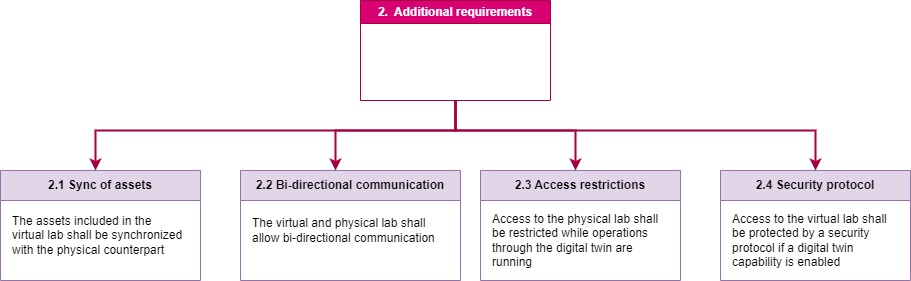
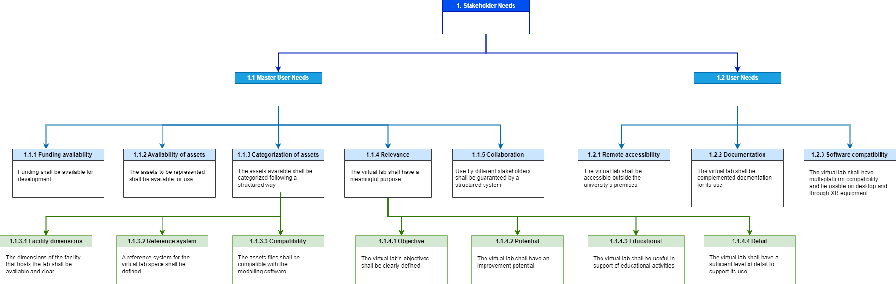

{:.no_toc}
# Requirements for the development and use of virtual labs 

{: .no_toc }

  

    Table of contents
  

  {: .text-delta }
- TOC
{:toc}

## Introduction

Defining requirements for the successful development and use of the virtual labs is of critical importance. Being aware of the needs of developers and users, before starting with the development itself, helps in reaching a better outcome when building the virtual lab itself. The definition of the requirements for this specific case derives from the process that has been followed throughout the VirLaDEE project. The requirements identified here derive from the material collected from the 3 institutions involved. This material includes the interviews to the lab’s stakeholders (managers, students, external users); the resources contained in the labs and their virtual counterparts; the outcomes of the VirLaDEE project in terms of development process of virtual labs. The approach that was used to define the requirements is inspired on part of the modelling framework “MagicGrid” (Aleksandravičienė & Morkevičius, 2021), used for the modelling of systems in Model-Based Systems Engineering approaches. In this approach, the first step is to define the Stakeholders’ Needs, and later define with a higher level of details all the requirements that derive from those. The definition of the requirements themselves follows the guidelines of INCOSE (Dick et al., 2012). The requirement definition follows a nested structure, with the level of detail increasing together with the levels of definition.
It is worth noting that the VirLaDEE project allows for increasing levels of virtualisation of the laboratories. Thus, this document describes a set of fundamental requirements that are needed for the initiation of lab virtualisation, but also an additional set of requirements that would be needed for a the development of further capabilities. The latter are not necessary in the initial stage, but are important in the case in which Digital Twins capabilities have to be developed.

## Fundamental requirements

The requirements are defined as “Stakeholder Needs”. These are further split into two main categories, as per [Figure 1:](#_bookmark0)

-   The “Master user” represents the developer of the virtual lab itself 
-   The “User” represents whoever has access and uses the virtual lab     (e.g. researcher, student, external stakeholder)

*Figure 1: Requirements
outer layer*

These are further defined in a deeper layer, as in [Figure 2](#_bookmark1) and [Figure 3.](#_bookmark2)

The requirements shown in [Figure 2](#_bookmark1) focus on what the developer would need in order to be able to build the virtual lab:

-   *1.1.1 Funding availability: Funding shall be available for     development.*

    -   Explanation: In order for the virtual lab to be developed, sufficient financial resources should be specifically allocated to it.

-   *1.1.2 Availability of assets: The assets to be represented shall be available for use.*

    -   Explanation: By “Asset” we mean the resources that are part of the laboratory (e.g. Robot arms, furniture, computers, any constituent element of the lab). In order for the virtual lab to have a sufficient level of accuracy with respect to the physical counterpart, all those assets must be available in a relevant and usable 3D format, so that the virtual layout can be created.

-   *1.1.3 Categorization of assets: The assets available shall be categorized following a structured way.*

    -   Explanation: The assets should have a set of common characteristics in such a way that they can be included into the virtual layout. The way these common characteristics is defined depends on the developer. In the case of the VirLaDEE project, these are specified in more details at [<u>https://virtualfactory.gitbook.io/vlft/kb/instantiation/assets/spreadsheet</u>](https://virtualfactory.gitbook.io/vlft/kb/instantiation/assets/spreadsheet). This requirement is also further defined in a deeper level.

-   *1.1.4 Relevance: The virtual lab shall have a meaningful purpose.*

    -   Explanation: The development of the virtual lab should be justified, and there must be a real need for its development, considering resources are put in place.

-   *1.1.5 Collaboration: Use by different stakeholders shall be
    guaranteed by a structured system.*

    -   Explanation: A single access or multi-user use mode should be
        established, and the appropriate framework developed.

*Figure 2: Master user
Requirements*
The requirements shown in [Figure 3](#_bookmark2) focus on what the
user needs in order to access and make use of the virtual lab:

-   *1.2.1 Remote accessibility: The virtual lab shall be accessible
    outside the university’s premises.*

    -   Explanation: Access to the virtual model of the lab should be
        granted to users who are not physically present at the
        university. This can be done differently based on the
        university

needs. Full open access could be granted, or alternatively, a VPN
provided to relevant stakeholders.

-   *1.2.2 Documentation: The virtual lab shall be complemented by
    documentation for its use.*

    -   Explanation: Relevant documentation on the use of the virtual
        lab has to be provided to the users.

-   *1.2.3 Software compatibility: The virtual lab shall have
    multi-platform compatibility and be usable on desktop and through XR
    equipment.*

    -   Explanation: The platform on which the virtual model of the lab
        is hosted should be compatible with the most common operating
        systems and computers, so to allow the students to access it
        without too much complexity. This is because the main purpose
        of the virtual lab is educational. The platform should be
        accessible from desktop, as well as XR equipment.

*Figure 3: User needs*

Furthermore, an additional level of detail is used for some of these
requirements, as shown in [Figure 4](#_bookmark3) and [Figure
5](#_bookmark4). The requirements of [Figure 4](#_bookmark3) can be
classified as system requirements, and represent the basic technical
needs for development:

-   *1.1.3.1 Facility dimensions: The dimensions of the facility (room)
    that hosts the lab shall be available and clear.*

    -   Explanation: In order for a precise layout to be created, and
        the relevant assets to be placed correctly, the lab should
        build using accurate dimensions. This information must be
        available to the developer.

-   *1.1.3.2 Reference system: A reference system for the virtual lab
    space shall be defined.*

    -   Explanation: For the assets to be placed correctly inside the
        virtual space, a reference system with coordinates should be
        in place, and the assets should be defined based on it.

-   *1.1.3.3 Compatibility: The assets files shall be compatible with
    the modelling software.*

    -   Explanation: For the modelling software to be able to read and
        use the assets files, these need to be compatible and have a
        proper extension.

*Figure 4: Categorization
of assets*
The requirement 1.1.4, as shown in [Figure 5,](#_bookmark4) can be
further broken down into 4 more detailed requirements:

-   *1.1.4.1 Objective: The virtual lab’s objectives shall be clear and
    defined.*

    -   Explanation: The creation of the virtual lab has to be done to
        fulfil a specific and well- defined objective.

-   *1.1.4.2 Potential: The virtual lab shall have an improvement
    potential*.

    -   Explanation: The existence of the virtual lab should be limited
        to the current use, but its development should show also
        future potential.

-   *1.1.4.3 Educational: The virtual lab shall be useful in support of
    educational activities.*

    -   Explanation: The main purpose of the virtual lab is to support
        educational activities, therefore its development should be
        justified by the use, in different extents, in some
        educational context.

-   1.1.4.4 Detail: The assets files shall have a sufficient level of
    detail to support its use.

    -   Explanation: In order for the virtual lab to be usable, the
        assets should be represented with a sufficient granularity
        level so that some actions can be performed on them. This
        level of detail changes based on the needs and the
        capabilities of the lab and its use.

*Figure 5: Relevance*

## Additional requirements

Additional requirements are defined for the future potential of the
virtual lab. The virtual lab in fact can potentially be used as a
Digital Twin, but only on specific cases and if needed. The following
requirements are shown separately because they do not constitute a
critical need for the development of the virtual lab, however they can
be added in the case in which the virtual lab is used as a digital
twin (or its precursor).
These requirements are not defined in detail because the scope of the
VirLaDEE project is not to produce Digital Twins, and in future use
they can be extended as needed. The diagram of [Figure 6](#_bookmark5)
shows these auxiliary requirements:

-   2.1 Synchronization of assets: The assets included in the virtual
    lab shall be synchronized with the physical counterpart.

    -   Explanation: For the virtual lab to work as a digital twin (or
        precursor), the assets of the lab and their virtual
        counterparts should synchronized with respect to a common
        reference system, and should be characterized by the same
        operational status.

-   2.2 Bi-directional communication: The virtual and physical lab shall
    allow bi-directional communication.

    -   Explanation: For the twins to be aligned, there must be active
        communication between the two, so to guarantee a feedback
        loop.

-   2.3 Access restrictions: Access to the physical lab shall be
    restricted while operations through the digital twin are running.

    -   Explanation: For safety reasons, in some labs, it I not possible
        to be close to the machines if they are being operated
        remotely. Therefore, it is important that access is monitored,
        and if needed restricted, while controlling the physical lab
        remotely.

-   2.4 Security protocol: Access to the virtual lab shall be protected
    by a security protocol if a digital twin capability if enabled.

    -   Explanation: In case the virtual lab has an active connection to
        the physical lab, security protocols must be put in place so
        to restrict access and limit potential damage.

*Figure 6: Auxiliary
requirements*

## Requirements distribution

Not all of the requirements presented above are critical for the
initial development of virtual labs. The development phases of the
virtual labs can be classified as foundational, intermediate, and
advanced. The fundamental requirements shown in this document are of
course valid for any phase in which the virtual lab is, but the
additional requirements are only necessary for an advanced development
of the virtual lab. This, for a pure illustration purpose, is shown in
[Figure 7](#_bookmark6).

*Figure 7: Requirements
per virtualization advancement*
A diagram representing all the “*1. Stakeholder Needs*” requirements
described above can be seen in [Figure 8](#_bookmark7). The “*2. Additional requirements*” are represented
in [Figure 9.](#_bookmark8) They are separate from the Stakeholder
needs because they are not critical for the development of the first
virtual labs.
With the increase in virtualization of the laboratory, the number of
requirements increases. A thorough definition of requirements is
important, but it depends on the scope of the virtual laboratory. The
requirements are enablers of a structured approach for the
virtualization of the laboratories, and should be defined
appropriately based on the needs. In this representation, the
additional requirements are shown as a standalone “block” with respect
to the stakeholder needs, but when planning the development of a
virtual lab with Digital Twins functionalities, it is advised to use
consider all the requirements as dependencies, and follow a nested
approach as the one mentioned in Paragraph 1. All requirements are
firstly identified with the stakeholders of the laboratories, and
further developed in detail, in relation to the characteristics of the
laboratory and the tools (software) used for the development. The
requirements are not to be intended as *set in stone*, but rather with
a semi-dynamic nature, that allows change and improvement. This is
particularly true with the virtualization advancement of the labs.

*Figure 8: Overview of all
stakeholders needs*

*Figure 9: Additional
requirement*

## References

* Aleksandravičienė, A., & Morkevičius, A. (2021). *MagicGrid® BOOK OF
KNOWLEDGE* (2nd ed.).
* Dick, J., Ryan, M., Wheatcraft, L., Zini, R., Baksa, K., Fernandez,
J., Smith, G., & Unger, C. (2012). *Guide for Writing Requirements*.
INCOSE; INCOSE-TP-2010-006-01.

