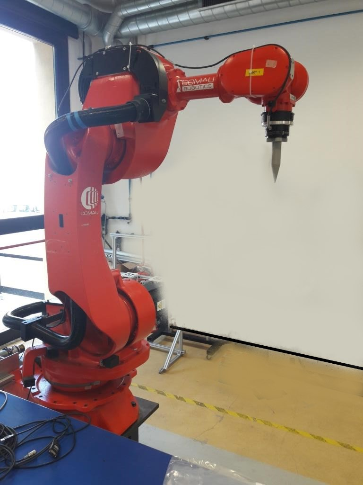
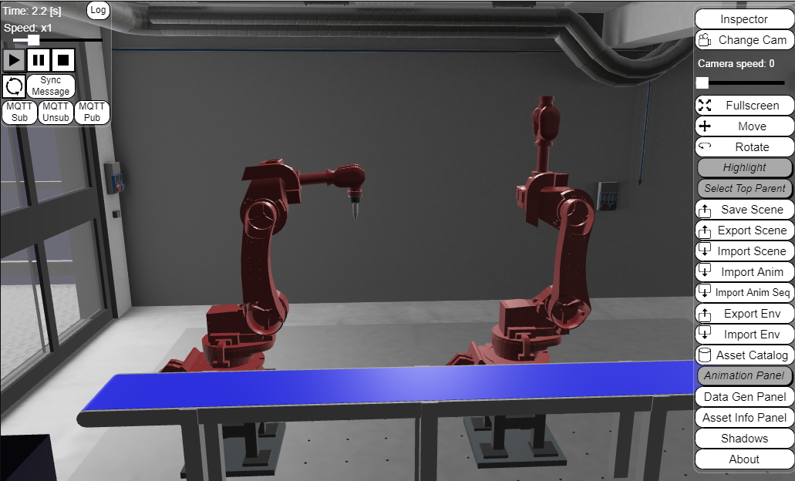
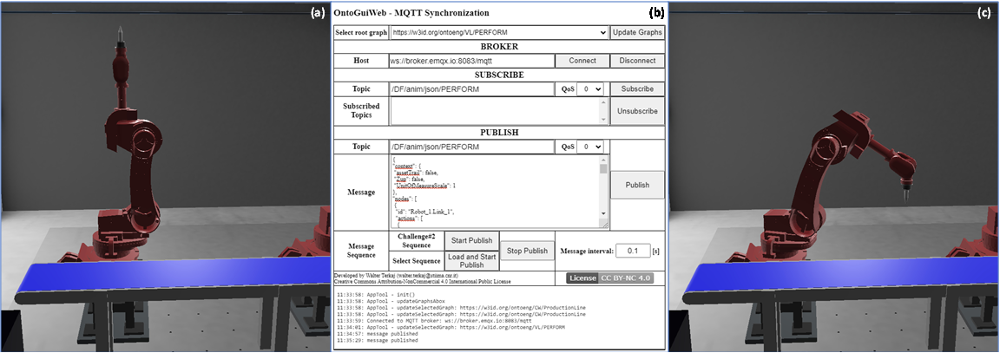
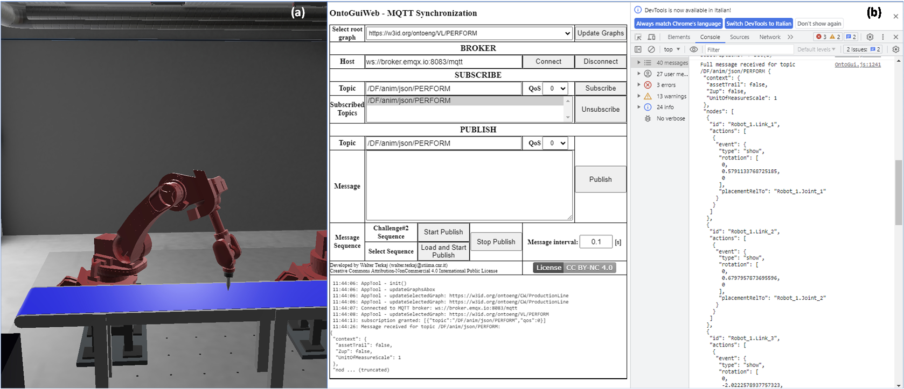
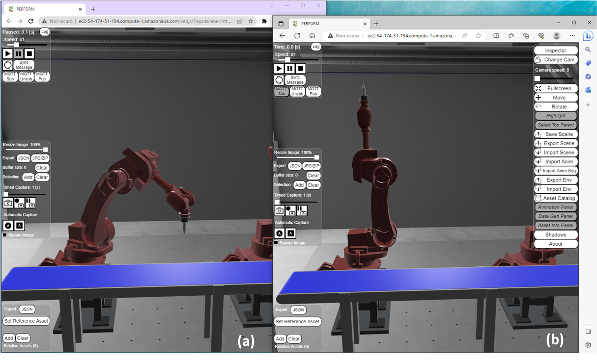
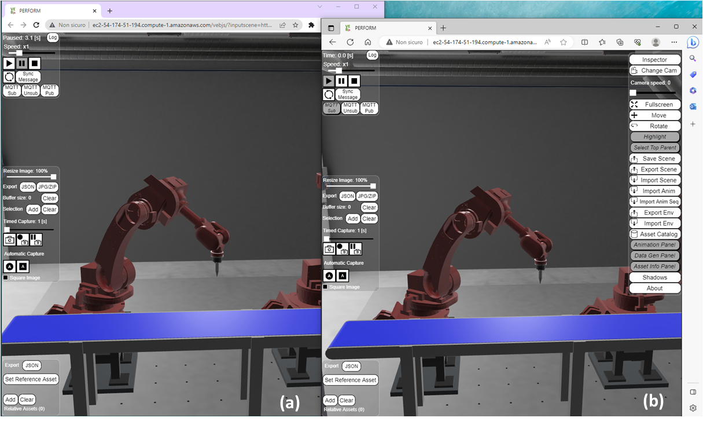

{: .no_toc }
# PERFORM Lab

{: .no_toc }
<details open markdown="block">
  <summary>
    Table of contents
  </summary>
  {: .text-delta}
- TOC
{:toc}
</details>

The PERFORM (PErsonal Robotics FOR Manufacturing) Lab, located at the premises of CNR-STIIMA, aims to develop and validate robotic technologies – and methods to control them – that help people improve their productivity and quality of work in the manufacturing industry. The key thematic areas are the human-robot collaboration, the task and motion planning, the physical interaction between man and robot, the rapid sorting, the man-robot and robot-robot co-manipulation.
The Lab has a very advanced state of development, as it benefits from the results and resources of past and ongoing research projects. Most of the projects focus on motion planning and human-robot interaction physics, and the control of the interaction. The updates and adaptations take place on an almost monthly basis, both in terms of layout and research topics, as the team is encouraged to experiment with further developments on the robotic equipment according to their interests.




*PERFORM Lab*

## Lab Assets

The Lab has an area of about 100 m2. It is structured as an open space populated by heavy industrial robots, collaborative robots, and mobile manipulators to create an ecosystem of interacting autonomous machines. In the current layout, the equipment comprises:

-   N.2 COMAU NS16 robots

-   Robot controller

-   Robot sensor

-   Robot end effector (tool)


The [Robot Operating System (ROS)](https://www.ros.org/) is the main software platform that is employed to address activities from research and prototyping to deployment and production. ROS is supported and tested on Linux, Windows, and macOS, as well as various embedded platforms (via micro- ROS), allowing seamless development and deployment of on-robot autonomy, back-end management, and user interfaces. ROS can be used in the context of the virtual lab to perform simulations, without the need to use the physical lab.

## Virtual Lab

The complete data formalization of the virtual lab can be found in:
<https://virladee.github.io/repo/spreadsheets/PERFORM.xlsx>

The [PERFORM virtual lab](http://virladee.github.io/repo/scenes/PERFORM/PERFORM.html) can be freely accessed online.



*PERFORM lab visualized with VEB.js*


## Lab Access

The research team is currently composed of the manager, three doctoral students and two researchers. The Lab has a strong partnership with the Automatic Controls for Industrial Robotics (CARI) Lab at the University of Brescia. The CARI Lab also includes three PhD students and performs different activities with two classes of master students.

Morevoer, past collaborations with technology providers were enabled by the PERFORM Lab.

The Lab can host a maximum of six people simultaneously, involved in the different applications.

Accessing the virtual lab remotely is possible through the web application VEB.js. The access to the virtual lab is open in its current configuration. Further data, not shown in this model, can be made accessible to relevant stakeholders if needed.

## Lab Activities

The activities performed in the Lab include seminars, visits and development of use cases, and they are recognised among course credits for students.
The primary learning objectives include:
* Programming and software development skills in the robotics field
* Ability to tackle and solve robotic problems
* Autonomy in solving issues
* Development of measurement protocols
* Use of models and algorithms for controls

Virtual Reality technology could be helpful to simulate the behavior of persons and the interaction with the robots. There is a great potential to adopt a fully immersive environment as assembly cells require the operator to be trained on complex tasks.

### Monitoring

The PERFORM Lab can be exploited to demonstrate the [monitoring functionalities](./VLmonitoring) using its virtual lab.
In particular, the two COMAU NS16 robots can be monitored in
terms of joint states while a robot is executing a trajectory. During
the execution of the trajectory, the robot controller can communicate
the joint state (i.e. position, velocity, force/torque, etc.) that in
turn can be stored (e.g. in a text-based file) or published (e.g. via
MQTT). Herein, we take in consideration only the joint position, i.e.
the rotation angle of the joint.

The joint angles are likely to be measured by sensors or encoders that
are attached to the robot joints. These sensors can generate data at a
high rate, potentially several times per second or even faster,
depending on the specific application and the performance requirements.

The joint positions of the robot in the PERFORM Lab are saved at 10 Hz
(i.e. one position is stored every 0.1 \[s\]) in a JSON file that
contains a list of position items, where each item defines the angles of
the joints in radians \[rad\]. Here below an example of item is shown:


```
{
"J1": 0.0,
"J2": 0.0,
"J3": 1.57,
"J4": 0.0,
"J5": -1.57,
"J6": 0.0,
"J7": 0.0,
"J8": 0.0,
"J9": 0.0,
"J10": 0.0
}
```


Each item of the list reports by default the value of 10 joint angles.
Robot\_1 of PERFORM Lab consists of 6 joints, therefore only joints from
"J1" to "J6" contain relevant values while the others (from "J7" to
"J10") will be always set to zero.

An example of robot trajectory can be found in the file
PERFORM\_trajectory\_example.json that defines a trajectory moving the
tool along the vertical axis. Using the command “**Load and Start
Publish**” of OntoGuiWeb – MQTT Synchronization module, the trajectory
can be published on the selected topic (e.g. ``/VL/PERFORM``) via MQTT
communication, thus emulating what the real robot controller would do.
Thanks to the “SUBSCRIBE” functionalities of MQTT Synchronization
module, it is possible to subscribe to the same topic to validate the
behaviour of the web application. The following figure shows a
screenshot of OntoGuiWeb while the messages of the trajectory are
published and received.


*OntoGuiWeb – MQTT Synchronization module interface*

### Dual-way Synchronization

The PERFORM lab can be used to demonstrate the functionalities of VEB.js supporting the [dual-way synchronization](./VLsynchronization). The exchanged messages represent the joint position of
the robot and can be formalized either according to the complete [JSON schema](./VLmonitoring#formalization-of-monitoring-data) or using a [simplified JSON schema](#monitoring). These functionalities can be exploited to make the virtual lab communicate with any software application that provides an MQTT protocol interface (e.g. [OntoGuiWeb](./VLmonitoring#ontoguiweb)).

The animation corresponding to the [example trajectory](https://virladee.github.io/repo/scenes/PERFORM/PERFORM_trajectory_example.json) is provided
according to the [JSON schema](https://virladee.github.io/repo/scenes/PERFORM/PERFORM_anim.json) and can be [played in VEB.js](https://virladee.github.io/repo/scenes/PERFORM/PERFORM.html) after
loading the virtual lab by pushing the play button in the animation
panel.


*VEB.js playing the animation of the example trajectory*

The planning, management, and monitoring of robots are complex tasks
that can be supported by specific software tools, e.g. [Gazebo](https://gazebosim.org/home),
[RoboDK](https://robodk.com/), [Process Simulate](https://plm.sw.siemens.com/en-US/tecnomatix/products/process-simulate-software/), and ROS-based tools like [MoveIt](https://moveit.ros.org/). Herein, the actual generation of these trajectories is out of
scope as they are taken as input. Specifically, robot trajectories for
the PERFORM Lab were generating using ROS-MoveIt.

[OntoGuiWeb](https://virtualfactory.gitbook.io/vlft/tools/ontoguiweb) can be used to emulate the robot
controller. Herein, the [EMQX broker](ws://broker.emqx.io:8083/mqtt) is exploited and the relevant
topic is defined as ``/DF/anim/json/PERFORM`` . In particular, it is
demonstrated that:

1.  OntoGuiWeb can send MQTT messages to the robot (messages meant as commands). In this case VEB.js subscribes to the topic ``/DF/anim/json/PERFORM`` and OntoGuiWeb publishes a message to the same topic with a content that is structured according to the [JSON schema](./VLmonitoring#formalization-of-monitoring-data).

2.  OntoGuiWeb can receive MQTT messages from the robot (messages meant as monitoring feedback). In this case OntoGuiWeb subscribes to the topic ``/DF/anim/json/PERFORM`` and VEB.js publishes a message to the same topic with a content that is structured according to the [JSON schema](./VLmonitoring#formalization-of-monitoring-data). The message published by VEB.js contains the snapshot of the current state of the lab, in particular Robot\_1.

In the first case (1), the message published by OntoGuiWeb is defined
as follows.

```
{
"context": {
"Zup": false,
"UnitOfMeasureScale": 1
},
"nodes": \[
{
"id": "Robot\_1.Link\_1",
"actions": \[
{
"event": {
"type": "show",
"rotation": \[0, 0.32722139946402584, 0\],
"placementRelTo": "Robot\_1.Joint\_1"
}}\]},
{
"id": "Robot\_1.Link\_2",
"actions": \[
{
"event": {
"type": "show",
"rotation": \[0, 0.3090268302958898, 0\],
"placementRelTo": "Robot\_1.Joint\_2"
}}\]},
{
"id": "Robot\_1.Link\_3",
"actions": \[
{
"event": {
"type": "show",
"rotation": \[0, -1.8045413352624902, 0\],
"placementRelTo": "Robot\_1.Joint\_3"
}}\]},
{
"id": "Robot\_1.Link\_4",
"actions": \[
{
"event": {
"type": "show",
"rotation": \[0, 0.00002110749907438238, 0\],
"placementRelTo": "Robot\_1.Joint\_4"
}}\]},
{
"id": "Robot\_1.Link\_5",
"actions": \[
{
"event": {
"type": "show",
"rotation": \[0, 1.0273638574399073, 0\],
"placementRelTo": "Robot\_1.Joint\_5"
}}\]},
{
"id": "Robot\_1.Link\_6",
"actions": \[
{
"event": {
"type": "show",
"rotation": \[0, 0.3272300418914053, 0\],
"placementRelTo": "Robot\_1.Joint\_6"
}}\]}
\]
}
```

The execution of the command can be visualized in VEB.js as shown in the
next figure.



*a) Robot in initial position, b) MQTT message sent by OntoGuiWeb, c)
updated position of robot*

In the second case (2), VEB.js publishes a message that is defined as
follows.

```
{
"context": {
"Zup": false,
"UnitOfMeasureScale": 1
},
"nodes": \[
{
"id": "Robot\_1.Link\_1",
"actions": \[
{
"event": {
"type": "show",
"rotation": \[0, 0.5791133768725185, 0\],
"placementRelTo": "Robot\_1.Joint\_1"
}}\]},{
"id": "Robot\_1.Link\_2",
"actions": \[
{
"event": {
"type": "show",
"rotation": \[0, 0.6797957873695596, 0\],
"placementRelTo": "Robot\_1.Joint\_2"
}}\]},{
"id": "Robot\_1.Link\_3",
"actions": \[
{
"event": {
"type": "show",
"rotation": \[0, -2.0222578937757323, 0\],
"placementRelTo": "Robot\_1.Joint\_3"
}}\]},{
"id": "Robot\_1.Link\_4",
"actions": \[
{
"event": {
"type": "show",
"rotation": \[0, -0.00003073769878651504, 0\],
"placementRelTo": "Robot\_1.Joint\_4"
}}\]},{
"id": "Robot\_1.Link\_5",
"actions": \[
{
"event": {
"type": "show",
"rotation": \[0, 0.4394223967319405, 0\],
"placementRelTo": "Robot\_1.Joint\_5"
}}\]},{
"id": "Robot\_1.Link\_6",
"actions": \[
{
"event": {
"type": "show",
"rotation": \[0, 0.5796292961377703, 0\],
"placementRelTo": "Robot\_1.Joint\_6"
}}\]}
\]
}
```

Finally, the message sent by VEB.js is received by OntoGuiWeb as shown
in the next figure.



*a) Position of the Robot when the message is published by VEB.js, b)
MQTT message received by OntoGuiWeb after subscribing to the topic*

VEB.js can play the role of both publisher and subscriber, while
exchanging messages that are structured according to the [JSON schema](./VLmonitoring#formalization-of-monitoring-data). This can be demonstrated by launching two instances of
the [PERFORM virtual lab](https://virladee.github.io/repo/scenes/PERFORM/PERFORM.html), e.g. two separate tabs in the same
browser of the same laptop/computer, or using two different browsers on
the same laptop/computer, or using whatever browser on two different
laptop/computer. After the two instances have been launched, one
instance will play the role of publisher and the other of subscriber to
the same topic, e.g. ``/DF/anim/json/PERFORM``.



*VEB.js visualization of the PERFORM lab in two different browsers, a)
Chrome and b) Edge, before the instance a) publishes an MQTT message*



*VEB.js visualization of the PERFORM lab after the instance a) has
published an MQTT message that was received by instance b)*