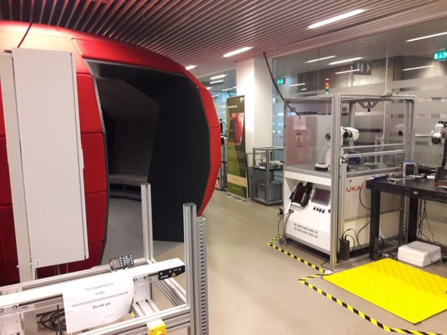
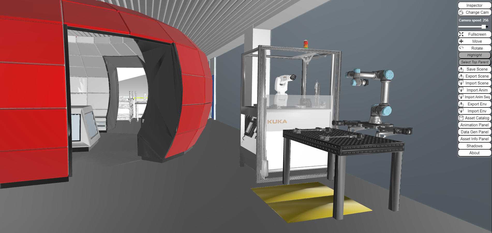

{: .no_toc }
# Smart Factory Lab

{: .no_toc }

  

    Table of contents
  

  {: .text-delta }
- TOC
{:toc}

The Smart Factory (SF) Lab supports
research and teaching at the section Technology Entrepreneurship and
Innovation (TEI) at SDU. The laboratory is targeting physical
implementation of simulations and is as such designed to support
Digital Twins.

The activities in the lab include building production systems, as part
of the course Production Technologies (P-TECH), as well as research in
Matrix-Structured Manufacturing Systems. The lab supports the design
of automation systems for modular machines. The current setup includes
5 modules that cover all aspects of the machine, including mechanical
structures, electrical systems and automation. A virtual model already
exists for such modules, and it can potentially be considered a
Digital Twin if bidirectional communication is enabled. Although the
machines can be operated remotely, this is currently not allowed due
to safety requirements, and the scope of the project itself. This
feature can be enabled in case the physical lab is directly linked to
the virtual model, and has restricted access.

The lab also includes a small workshop area for light assembly and
minor processing of production equipment.

The teaching activities carried out in the Smart Factory Lab require
the physical attendance of students. The learning objectives of the
P-TECH course include the ability to analyse and solve problems posed
by real-life situations in the field of automation development. At the
current state it is necessary for students to physically operate in
the lab. A future development could include a detailed representation
of the physical components to allow students to operate them
virtually, with the aid of Virtual Reality.

*Smart Factory Lab*

## Lab Assets

The Smart Factory Lab is currently used for research and educational
purposes. To support these activities, the laboratory consists of
three main areas, and is equipped with relevant assets. 

<table>
<colgroup>
<col style="width: 38%" />
<col style="width: 61%" />
</colgroup>
<thead>
<tr class="header">
<th><strong>Name</strong></th>
<th><strong>Description</strong></th>
</tr>
</thead>
<tbody>
<tr class="odd">
<td>KUKA KR3 R540</td>
<td>KUKA Ready2Educate Advanced Vision</td>
</tr>
<tr class="even">
<td>UR5e</td>
<td>Collaborative Robot</td>
</tr>
<tr class="odd">
<td>Siemens PLCs (ET200SP, S7- 1500, S7-1200)</td>
<td>PLC</td>
</tr>
<tr class="even">
<td>B&amp;R PLC (X20CP1686)</td>
<td>PLC</td>
</tr>
<tr class="odd">
<td>Matrix Production Cell</td>
<td>
Contains:KUKA robot

<ul>
<li>
UR5e
</li>
<li>
IGUS 7th axis for UR5e
</li>
<li>
Siegmund Welding table
</li>
<li>
LINAK LA36 actuator
</li>
<li>
Custom Control Cabinet
</li>
<li>
Kolver Screw Driver
</li>
</ul></td>
</tr>
<tr class="even">
<td>Unimat Lathe</td>
<td>Small educational CNC lathe on custom transport carrier</td>
</tr>
<tr class="odd">
<td>Unimat Mill</td>
<td>Small educational CNC mill on custom transport carrier</td>
</tr>
<tr class="even">
<td>3 gravity conveyors</td>
<td>For teaching purposes (P- TECH)</td>
</tr>
<tr class="odd">
<td>2 belt conveyors</td>
<td>For teaching purposes (P- TECH)</td>
</tr>
<tr class="even">
<td>2 3D printers</td>
<td>Unimat + FlashForge Inventor</td>
</tr>
</tbody>
</table>

**XR Software tool**: Unity.

**Simulation Software tools**: Siemens Tecnomatix Plant Simulation, Visual
Components, Siemens NX Mechatronics Concept Designer, Anylogistix,
Siemens Tecnomatix Process Simulate.

## Virtual Lab

The complete data formalization of the virtual lab can be found in:
<https://virladee.github.io/repo/spreadsheets/SmartFactory.xlsx>

The [Smart Factory virtual lab](http://virladee.github.io/repo/scenes/SmartFactory/SmartFactory.html) can be freely accessed online.

*Smart Factory lab visualized with VEB.js*

## Lab Access

Both researchers and students at the Engineering, Innovation &
Business study program can get access to support their activities.
Student access is granted in close dialogue with the lab manager,
supervisor, and head of section to ensure all safety measures are
being followed. The same rules apply for external stakeholders in
regard to access to the lab.

The access to the virtual smart factory lab is open in its current
configuration. Further data, not included in this model, can be made
accessible to relevant stakeholders if needed.

## Lab Activities

Repurposing used lab equipment and machines constitutes one of the
goals at the SF lab. The Virtual Lab supports researchers in this
activity. One of the possible uses of the virtual lab includes
discrete-event simulation, to support layout reconfiguration or the
repurpose of modular machines. Testing new scenarios virtually avoids
the need to move the machinery, which constitutes a difficulty. The
purpose of this use is prediction, and its main value is time-saving
and risk reduction. On the other hand, the operation of the

machines is valuable on the physical lab, but not justified in the
virtual counterpart, for the time being. The use of the virtual lab
for testing purposes is only enabled by detailed models of the
mechanical systems, electrical diagrams and PLC programs for each of
the machines. For these reasons, at the time being, the testing of the
machines is only done physically.

The model of the Smart Factory Lab shows a real potential for the use
in teaching activities, in the case of a pandemic or in general when
remote access is required. The current state of the Virtual lab allows
Digital Shadow implementation, as shown by past experiments. The
remote use of the physical Smart Factory Lab currently does not
justify the risks associated with it. Safety issues arise when
operating experimental machines remotely, and this is not in the scope
of project. Nevertheless, in case of accessibility restrictions (e.g.
a pandemic), the development of a Digital Shadow, or even a Digital
Twin, is possible. At the current state the Virtual Lab exists (also)
as a 3D model of the real one, with a certain level of accuracy, and
can be explored through on-screen or world-space menus.

The potential for the virtual use of the Smart Factory Lab is enhanced
by the combination of the lab with the VR Lab and Simulation Lab. Past
experiments showed in fact that the equipment stored in the Smart
Factory Lab can be accessed through its digital model, and one-way
interaction is possible. This was verified in the context of the
matrix production cell, which could be controlled remotely from a 3D
environment. This represented the case of a Digital Shadow, with the
physical asset under control of the virtual counterpart.

Research for the implementation of a Digital Twin is currently
undergoing. A set of conveyor belts in the Smart Factory Lab is
equipped with sensors (e.g. force, speed, temperature etc.) which
provide data to a server, where a machine learning algorithm collects
it and processes it for the scope of predictive maintenance. Visual
Components and Unity have been used to develop the 3D model, whereas
Azure hosts the data collected.