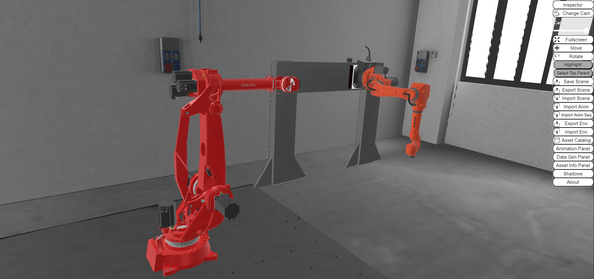

{: .no_toc }

  

    Table of contents
  

  {: .text-delta }
- TOC
{:toc}

# DARB Lab

The DARB (Disassembly using Autonomous Robot for Batteries) lab,
previously named IINFORM lab, has been designed and installed by
CNR-STIIMA and is hosted by University of Brescia.

## Lab Assets

The laboratory is equipped with relevant assets but is still under development. Currently, the main assets of the lab include:

-   Kuka KR50 robot with KRC5 control of 45 kg mounted on a linear axis

-   Controller of Kuka robot

-   Structural element for Kuka robot

-   Comau NJ220 robot of 220 kg with control C5GOpen

-   Controller of Comau robot

The [Robot Operating System (ROS)](https://www.ros.org/) is the main software platform that is employed to address activities from research and prototyping to deployment and production. ROS is supported and tested on Linux, Windows, and macOS, as well as various embedded platforms (via micro- ROS), allowing seamless development and deployment of on-robot autonomy, back-end management, and user interfaces. ROS can be used in the context of the virtual lab to perform simulations, without the need to use the physical lab.

## Virtual Lab

The complete data formalization of the virtual lab can be found in:
<https://virladee.github.io/repo/spreadsheets/DARB.xlsx>

The [DARB virtual lab](http://virladee.github.io/repo/scenes/DARB/DARB.html) can be freely accessed online.

*DARB lab visualized with VEB.js*

## Lab Access

Access to the physical lab is currently restricted due to safety reasons (risk of explosion of batteries), and due to the undergoing set up work.

Accessing the Virtual Lab remotely is possible through the web application VEB.js. The access to the virtual lab is open in its current configuration. Further data, not shown in this model, can be made accessible to relevant stakeholders if needed.

## Lab Activities

The potential of the virtual lab is enhanced by the open-source nature of the software used. Moreover, the multi-platform support enables users to simulate scenarios in desktop mode. 

Virtual Reality systems could help in simulating the interactions of people with the laboratory equipment, such as collision analysis with the robots. The virtual lab will enable users to test and simulate this kind of scenarios without working in physical contact with the machinery, thus decreasing risks and waste in terms of resources and time. The potential use of a virtual environment of the DARB lab goes beyond this. Training operators with an extended reality setup is useful, especially in case of complex tasks. Augmented Reality solutions can assist operators during critical and hazardous tasks, such as the disassembly of batteries. 