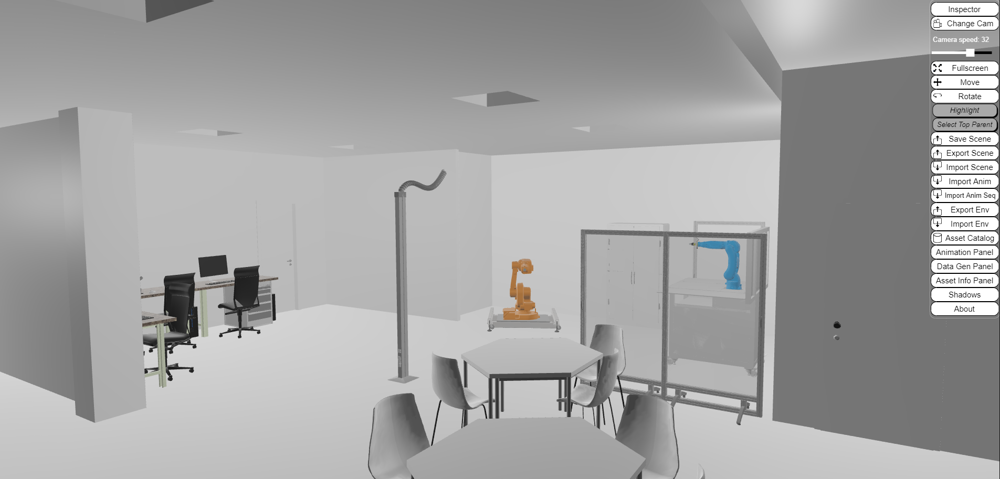

{: .no_toc }

  

    Table of contents
  

  {: .text-delta }
- TOC
{:toc}

# IVAR Lab

The Industrial Augmented and Virtual Reality Laboratory (IVAR) is part
of the Flexible Manufacturing and Robotic Centre, at TalTech in Tallinn. The
focus of this research group is to develop applications for industrial
use cases through Virtual and Augmented Reality technologies. The
applications are developed to support teaching, training, and
specialized industrial solutions. The laboratory supports
user-centered application development and interface testing, together
with the implementation of AR/VR exergame aimed at clinical tests and
rehabilitation. Together with the IVAR, at least two more regular
research groups share the same equipment. One person is responsible
for the physical laboratory, while management is carried out by the
university department. Apart from the scientific work related to each
research group mentioned before, the lab is involved in different
teaching, application development activities and training for
industries.

## Lab Assets

The IVAR is hosted in context of the Flexible Manufacturing and
Robotic centre, and it occupies a room of 139 m2. It is currently used
for research and educational purposes. To support these activities,
the laboratory is equipped with relevant assets.

<table>
<colgroup>
<col style="width: 20%" />
<col style="width: 40%" />
</colgroup>
<thead>
<tr class="header">
<th><strong>Name</strong></th>
<th><strong>Description</strong></th>
</tr>
</thead>
<tbody>
<tr class="odd">
<td>ABB IRB 1600</td>
<td>Industrial robot</td>
</tr>
<tr class="even">
<td>TM5 900 OMRON</td>
<td>Collaborative robot</td>
</tr>
<tr class="odd">
<td>Motoman GP8</td>
<td>Industrial robot with training cell</td>
</tr>
<tr class="even">
<td>FESTO</td>
<td>
Flexible manufacturing system including a CNC machine, a Storage
block FESTO

Robotino mobile robot platform for research and education.
</td>
</tr>
<tr class="odd">
<td>DIMUSA</td>
<td>IoT real-time monitoring system for industrial machinery</td>
</tr>
<tr class="even">
<td>Nikon 3D scanner</td>
<td>Nikon 3D scanner</td>
</tr>
<tr class="odd">
<td>Conveyor belt</td>
<td>Custom-made industrial conveyor belt</td>
</tr>
</tbody>
</table>

**AR/VR equipment**: Oculus rift S, Oculus Quest, Oculus Quest 2, Oculus
Go, HTC Vive and Vive Trackers, Valve Index, HTC Vive Pro Eye, Dell
Visor, Meta 2, HoloLens 2, Vuzix M300, Manus VR, NextMind, Leap Motion.

**Simulation software tool**: Siemens Tecnomatix Plant Simulation, Visual
Components 4.3, ARENA – Rockwell automation, Siemens Tecnomatix Process Simulate.

**CAD Software tools:** SolidWorks, CAD Software, SolidEdge, Blender, Autodesk
3D Max, Unity 3D.

## Virtual Lab

The complete data formalization of the virtual lab can be found in:
<https://virladee.github.io/repo/spreadsheets/IVAR.xlsx>

The [IVAR virtual lab](http://virladee.github.io/repo/scenes/IVAR/IVAR.html) can be freely accessed online.

*IVAR lab visualized with VEB.js*

## Lab Access

Both researchers and students at TalTech can get access to support their activities. These include course- related projects, BSc and MSc thesis. PhD students are also using the equipment for industrial process optimization, production monitoring, machine integration, and development of AR/VR applications in different fields. The courses which make use of the lab are Business Information and Technology; Computer and Systems Engineering; Industrial Engineering and Management; Mechatronics; Product Development and Robotics; Telematics and Smart Systems. Stakeholders access is granted following the lab’s manager approval.

Accessing the Virtual Lab remotely is possible after prior agreement with the lab management. Access is restricted to protect sensible information but can be granted to relevant stakeholders when needed.

## Lab Activities

The laboratory currently features a Digital Twin Virtual Reality simulation, which allows for extended interactions and control with several machines. The ABB and Motoman GP8 robot twins are fully synchronized and have a programming and control UI in VR. Recently, the Omron collaborative robot  was
 
added to the system through a ROS-based control and programming interface synchronized with the real robot via the MQTT protocol. While other components are included in the digital representation of the lab, they do not have any interface or possible interaction in VR. All VR/AR controls and interfaces can be used remotely, and a mobile-based interface works as a laboratory control dashboard for controlling all synchronized machines and autonomous logistics robots. Although most of the robots and systems in the lab have their own proprietary control and programming software, VR visualization and integration have not been fully utilized in most cases.
The FESTO system is a use case for production process monitoring through IoT sensors, with parameters and KPIs visualized in real-time on a desktop-based dashboard. Generally, the lab's systems are employed as use cases for process optimization and monitoring through various simulation software, some of which include VR integration tools and plugins. However, the adoption of AR/VR based tools for teaching is quite limited and primarily used for developing specific course projects in some of the above-mentioned studies but not as alternatives to other digital teaching tools.

