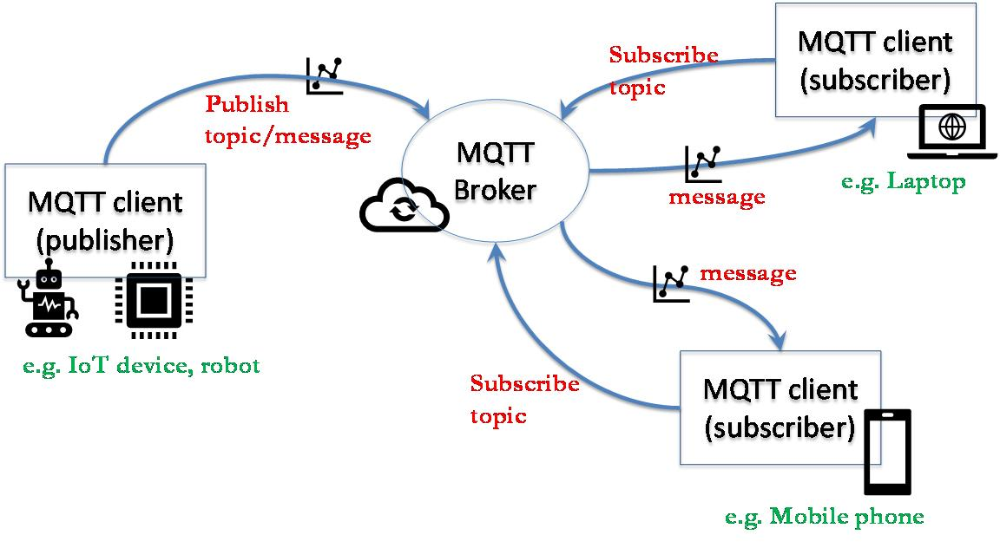
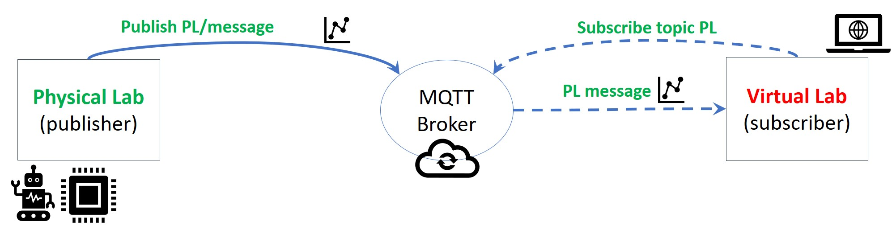

{:.no_toc}
# Monitoring of the physical labs

{: .no_toc }

  

    Table of contents
  

  {: .text-delta }
- TOC
{:toc}

Monitoring of physical labs is included among the key feature of the
more general Digital Twin architecture, as discussed in the article by Modoni et al. \[1\].

An effective monitoring asks for 1) predefined schema to formalize data
that are exchanged and 2) a communication channel. The following
sections address these two requirements and present the solution
developed for Virtual Labs.

## Formalization of monitoring data

During monitoring, the states and properties of assets evolve along
time. Unfortunately, the data formalization adopted for defining assets
of a physical lab is not appropriate, since the properties
are static. Therefore, herein another data schema is used to capture the
evolution of monitoring data while keeping consistency with the schema
defining the assets.

The proposed schema can be used to serialize data in JSON files that are
produced/consumed by software applications related to the virtual lab.
The same schema can be used to formalize the evolution of assets related
to historical data or simulated data. In same cases, the raw message can
be serialized according to a different schema, thus needing a
preliminary elaboration and conversion (e.g. example in Sect.4).

The JSON schema is composed of three root properties:

-   “**context**”: set of properties of initial setup

-   "**nodes**": an array defining what happens during the asset
    evolution

-   "**sequences**": an array defining sequences of asset animation
    (mainly space&time)

The “**context**” is characterized by the following property:

-   "**UnitOfMeasureScale**": (optional) unit of measure scale (e.g.
    0.01 stands for centimeter, whereas 1 stands for meter). If not
    defined, then the unit of measure of the associated scene is
    adopted.

Each item in the “**nodes**” array contains the following properties
(all required):

-   "**id**": unique identifier of the asset that is characterized in
    terms of evolution \[required\]

-   "**actions**": array of actions that are relevant for the asset
    evolution

Each item in the “**actions**” array contains the following properties (all required):

-   "**trigger**": specifying when the action takes place with
    properties “type” and “data”

-   "**event**": specifying what action takes place with properties
    “type” and “data”

Possible values for “**type**” of “trigger”:

-   "**timestamp**": the value in “data” is interpreted as time in
    milliseconds after the start of asset evolution

Possible values for “**type**” of “event”:

-   "**animation**": the asset starts an animation. The value of “data”
    property defines the animation sequence to be employed, specified
    either as the ID of an item in the array of "sequences" or as the
    path of the file (.bin or .txt) containing the animation sequence as
    text. The positions and rotations are defined in absolute terms, but
    if the additional property “placementRelTo” is defined then it must
    be intended in relative terms.

-   "**animationAdditive**": the asset starts an animation. The value of
    “data” property defines the animation sequence to be employed,
    specified either as the ID of an item in the array of "sequences" or
    as the path of the file (.bin or .txt) containing the animation
    sequence as text. The animation is intended as additive
    (incremental) with respect to the current placement (position,
    rotation) of the asset.

-   “**show**”: the asset is shown in the scene. The place where the
    asset appears is defined with additional properties (as for the
    scene definition): "position" (default value \[0.0,0.0,0.0\]),
    “scale" (default value \[1.0,1.0,1.0\]), "rotation" (default value
    \[0.0,0.0,0.0\] Euler angles YXZ in radians), "placementRelTo". For
    instance, if only "placementRelTo" is defined, then position, scale
    and rotation have default values.

-   “**attach**”: the asset keeps its absolute position, rotation and
    scale, but its location in the scene graph is updated according to
    the value of property "placementRelTo". If "placementRelTo" is empty
    or not defined, then the asset is attached to the root node in the
    scene graph.

-   “**hide**”: the asset is hidden from the scene

-   “**state**”: the asset changes its state in terms of 3D
    representation and description. The state is specified by the
    following properties, all optional:

    -   “**data**” property is a string with the file path of the 3D
        representation file (e.g. .obj). The new 3D representation
        completely replace the (possibly) existing mesh while inheriting
        its attributes (e.g. position, rotation, scaling).

    -   "**descr**" is a string with the description of the current
        state. This description is incremental and does not replace the
        static description of the asset.

-   “**link**”: link to a (text) file that is specified by the following
    properties:

    -   “**data**” is a string with the local file path

    -   "**descr**" is a string with the description of the content that
        is found at the link

    -   “**URL**” is the address where the file can be downloaded from

Each item in the “**sequences**” array contains the following
properties:

-   "**id**": unique identifier of the animation sequence

-   "**FPS**": integer defining the FPS (frame per second).

-   "**pos**": \[optional\] array of positions in the 3D space for each
    frame.

-   "**rot**": \[optional\] array of rotations (as Euler angles YXZ in
    radians or alternatively as quaternion for "animation" and
    axis-angle for "animationAdditive") in the 3D space for each frame.

## MQTT communication

An efficient and effective communication channel is fundamental for
monitoring and synchronizing the physical lab and its virtual
counterpart.

[MQTT (Message Queuing Telemetry Transport)](https://mqtt.org/) is a lightweight,
publish-subscribe messaging protocol that is commonly used in the
Internet of Things (IoT) and other applications. MQTT can be exploited
for monitoring assets, but also for bi-directional communications with
assets that can:

-   send feedback about current state and value of dynamic properties

-   receive commands for the execution of actions, change of setup, etc.

*General MQTT architecture*

Different programming languages can be used to develop MQTT clients that
participate in a MQTT communication architecture, e.g. JavaScript and
Pyhton libraries. In addition to publishers and subscribers, the MQTT
architecture needs a broker to manage messages.

Several resources are freely available online to develop MQTT
architectures:

-   tools to develop and test MQTT architecture/components (e.g.
    MQTTLens)

-   free public MQTT broker, e.g. [broker.emqx.io](https://www.emqx.com/en/mqtt/public-mqtt5-broker)

-   desktop MQTT client, e.g. [MQTTX](https://mqttx.app/)

-   tutorials on MQTT and related tools, e.g. [this tutorial](http://www.steves-internet-guide.com/using-mqtt-lens/)

-   libraries to develop MQTT components, e.g. [MQTT.js library](https://www.npmjs.com/package/mqtt)

The monitoring can be realized by exploiting the MQTT
architecture, as shown in the following figure.The Physical Lab
(PL) plays the role of publisher and the Virtual Lab (VL) plays the role of
subscriber to the PL topic.

The controller on the side of the physical lab will take care of generating the outcoming messages, while the software tools on the virtual lab side will elaborate the incoming messages.

*MQTT-based architecture for dual-way synchronization*

## OntoGuiWeb

OntoGuiWeb is a web application providing a graphical user interface for
the instantiation and exploration of digital models, in particular
defined as OWL ontologies. OntoGuiWeb was first developed during
previous projects and works on any browser without specific
configuration of the hardware is needed. OntoGuiWeb is developed in
JavaScript making use of libraries rdflib, opn, path, server,
xmlhttprequest. Source code of OntoGuiWeb is available upon request for
non-commercial applications.

A demo of OntoGui Web is [available online](https://difactory.github.io/DF/tools/OntoGuiWeb.html) and includes the
following basic modules: Control Panel, Utilities, Asset Design, System
Design, System Control, Performance Evaluation, Virtual Environment,
StateChart, SPARQL.

During the VirLaDEE project the novel OntoGuiWeb module name MQTT Sync
was designed and implemented, taking advantage of the JavaScript library
MQTT.js.

The MQTT Sync module provides an MQTT client that can:

-   publish a message on a topic

-   subscribe to topics

In addition, it is possible to load a sequence of messages ("Message
Sequence") as a JSON list and publish them automatically and iteratively
based on a predefined time interval ("Message interval").

*OntoGuiWeb – MQTT Synchronization module interface*

An **example of monitoring** is provided for the [PERFORM Lab](./UC_PERFORM#monitoring) use case.

## References

1.  Modoni GE, Caldarola EG, Sacco M, Terkaj W (2019) Synchronizing
    physical and digital factory: benefits and technical challenges.
    Procedia CIRP, 79:472-477

