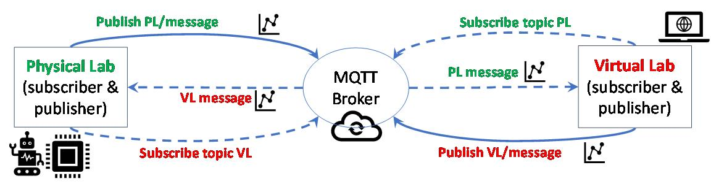
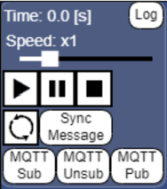

{: .no_toc }

  

    Table of contents
  

  {: .text-delta }
- TOC
{:toc}

# Dual-way synchronization between the physical lab and the virtual lab

The dual-way synchronization between the physical lab and the virtual
lab helps complete the full digital twin architecture, going beyond the
unidirectional monitoring \[1\].

The dual-way synchronization can be realized by exploiting the MQTT
architecture, as shown in the following figure. Both the Physical Lab
(PL) and the Virtual Lab (VL) can play the role of publisher and
subscriber, depending on the intended communication flow:

1.  The physical lab subscribes to the VL topic and publishes to the PL
    topic

2.  The virtual lab subscribes to the PL topic and publishes to the VL
    topic

The controller on the side of the physical lab and the software tools on
the virtual lab side will take care of generating the outcoming messages
and elaborating the incoming messages.

The data formalization adopted for MQTT messages is the same defined in
O3-A2, but again it may happen that the raw message is serialized
according to a different schema, thus needing a preliminary elaboration
and conversion.

## MQTT functionalities of VEB.js

Most of the VR environments enable interactions and animations that can
be exploited to visualize the current monitoring of assets. After the
[visualization and navigation of the virtual labs](/docs/VLdevelopment.html#visualization-of-virtual-labs), the VEB.js web application can be exploited also to support the dual-way
synchronization thanks to the modularity of the project and the
flexibility of JavaScript language. Therefore, during the VirLaDEE
project a novel VEB.js module was designed and implemented, taking
advantage of the JavaScript library MQTT.js, to provide an MQTT client
that is able to publish and subscribe.

Specifically, the Animation panel of VEB.js has been upgraded with the
following commands:

-   “**MQTT Sub**” to subscribe to topics and receive messages
    containing the updated position and state of the assets. The topic
    name is defined based on the input configuration and scene id.

-   “**MQTT Unsub**” to unsubscribe from all topics

-   “**MQTT Pub**” to publish a message that contains the snapshot of
    the assets in terms of position and state. The topic name is defined
    based on the input configuration and scene id.

*Animation panel of VEB.js*

The “show” event (cf. [data formalization](/docs/VLmonitoring.html#formalization-of-monitoring-data)) is typically enough
to support the implementation of the dual-way synchronization, but more
advanced event type can be employed as well.

## References

1.  Modoni GE, Caldarola EG, Sacco M, Terkaj W (2019) Synchronizing
    physical and digital factory: benefits and technical challenges.
    Procedia CIRP, 79:472-477
